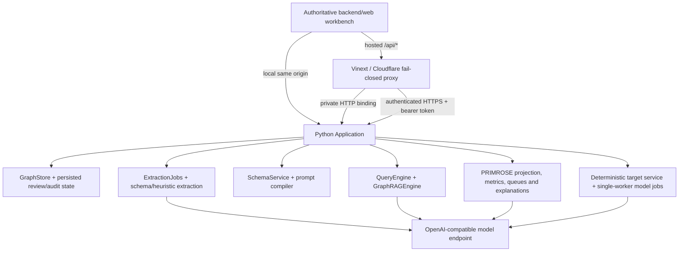

# Architecture and trust boundaries

The implementation keeps the supplied Python application as the system of record. PRIMROSE is integrated into that application and its original frontend rather than replacing it with a separate React data model.

## One frontend, two delivery paths

`backend/web/index.html`, `backend/web/app.js`, and `backend/web/styles.css` are authoritative. The local Python server serves those files directly. `scripts/sync-workbench.sh` copies them to `public/workbench/` before Site development and production builds, and the Site root redirects to `/workbench/index.html`.

The Next/Vinext layer is therefore a hosting bridge, not an alternative React workbench. Its catch-all `app/api/[...path]/route.ts` preserves the original `/api/*` contract. The former `/api/primrose/*` adapter, React-only workbench, and bundled data snapshot have been removed.

## Python application boundary

`Application` composes the existing `GraphStore`, deterministic `QueryEngine`, `GraphRAGEngine`, `SchemaService`, and `ExtractionJobs` with `PrimroseWorkbench`. The original workflow remains available through the same store and routes:

- document extraction calls `ExtractionJobs.submit_document()` and then imports candidates into `GraphStore`;
- review decisions and audit events remain owned by `GraphStore`;
- deterministic and GraphRAG questions remain routed by `Application.answer()`;
- schema selection remains persistent and controls subsequent extraction prompts;
- target dossiers continue to be built by `target_development.develop()`.

PRIMROSE analytics read a copy returned by `GraphStore.export_graph(include_review=True)`. They do not write metric results back to graph records, promote predictions, or change review decisions. Model and rule integrations have zero numerical score weight.

## Deliberate integrity remediations

The workflow and reasoning contracts were retained, but it would be inaccurate to claim every supplied core file is byte-for-byte unchanged. These narrow fail-closed defects were remediated and covered by regression tests:

- client graph imports cannot assert managed `review_status`, `review_reason`, or `host_derived` fields;
- only the trusted in-process extraction path may retain its deterministic `host_derived` provenance scaffolding;
- a merge that changes an already reviewed node invalidates that review and records an audit event;
- protected/restricted objects and personnel can no longer bypass target screening through the legacy `allow_personnel` flag;
- the UI disables GraphRAG unless dependencies and the configured endpoint are reachable, uses CSP-safe graph colours, and refreshes live source/schema state after changes.

These changes strengthen trust boundaries; they do not replace entity extraction or graph-retrieval logic with PRIMROSE logic.

## Additive modules

| Location | Responsibility |
|---|---|
| `backend/kg_backend/schema_service.py` | Persistent manual ontology selection plus deterministic, unsaved topic suggestions and prompt previews |
| `backend/primrose/analytics.py` | Deterministic projection, topology observations, applicability reasons, snapshot hashing, and non-renormalising score calculation |
| `backend/primrose/registry.py` | 111 reusable method definitions shown by UI information controls |
| `backend/primrose/profiles.py` | Five versioned, non-overlapping starting profiles |
| `backend/primrose/adapters.py` | Explicit status contracts for optional model, rule, temporal, and calibration tooling |
| `backend/primrose/gemma4.py` | Optional explanation-only OpenAI-compatible provider with bounded input, structured-output validation, citation allow-list, cache, retry, and circuit breaker |
| `backend/primrose/target_service.py` | Exact-ID deterministic target-development preview and screening adapter |
| `backend/primrose/target_jobs.py` | Persisted, single-worker asynchronous model generation for target-development sections |
| `backend/primrose/service.py` | Live workbench facade, queues, traces, and object diagnostics |

## Hosted proxy boundary

The Site proxy:

- accepts same-origin requests only;
- forwards raw `ArrayBuffer` bodies so PDFs and other binary uploads are not re-encoded;
- allow-lists request and response headers and sanitises `X-Filename`;
- limits document uploads to 25 MiB and other API bodies to 30 MiB, preserving the original graph-import allowance;
- uses route-specific timeouts: 20 seconds normally, 60 seconds for uploads/import/export, and 150 seconds for query/explanation calls;
- accepts only HTTPS public backend URLs, except loopback HTTP for local development;
- adds `Authorization: Bearer $PRIMROSE_BACKEND_TOKEN` server-side and never exposes that secret to the browser;
- can instead call a registered `CUSTOMER_HTTP_PRIMROSE_BACKEND` private binding;
- returns an explicit `503` when the backend is missing, invalid, unreachable, or times out.

There is intentionally no synthetic or cached API response path.

## Persistence and deployment

The owner container refuses to start without a backend token of at least 32 characters. Except for minimal `/healthz`, every container route requires that token. The Compose configuration binds the service to loopback and mounts a named volume at `/data` for the graph, review/audit state, ontology selection, extraction artefacts/jobs, and target-development job records.

A Site deployment contains static assets and the TypeScript proxy only. It does not contain a Python runtime, the persistent volume, or the model. Full hosted operation therefore requires an attached private service or authenticated HTTPS container and a separately reachable OpenAI-compatible model for LLM-dependent functions.

## Epistemic separation

- Source assertions retain accepted, unreviewed, or rejected review state.
- Prediction records are excluded from the analytical topology even if a generic review field says accepted.
- Model/rule candidates belong in Hypotheses, outside the accepted graph.
- GraphRAG and Gemma explain retrieved evidence and calculations; neither contributes a score.
- Missing inputs serialise as `null` with an applicability reason, never as zero.
- If any required composite contributor is unavailable, the composite is unavailable; remaining weights are not renormalised.
